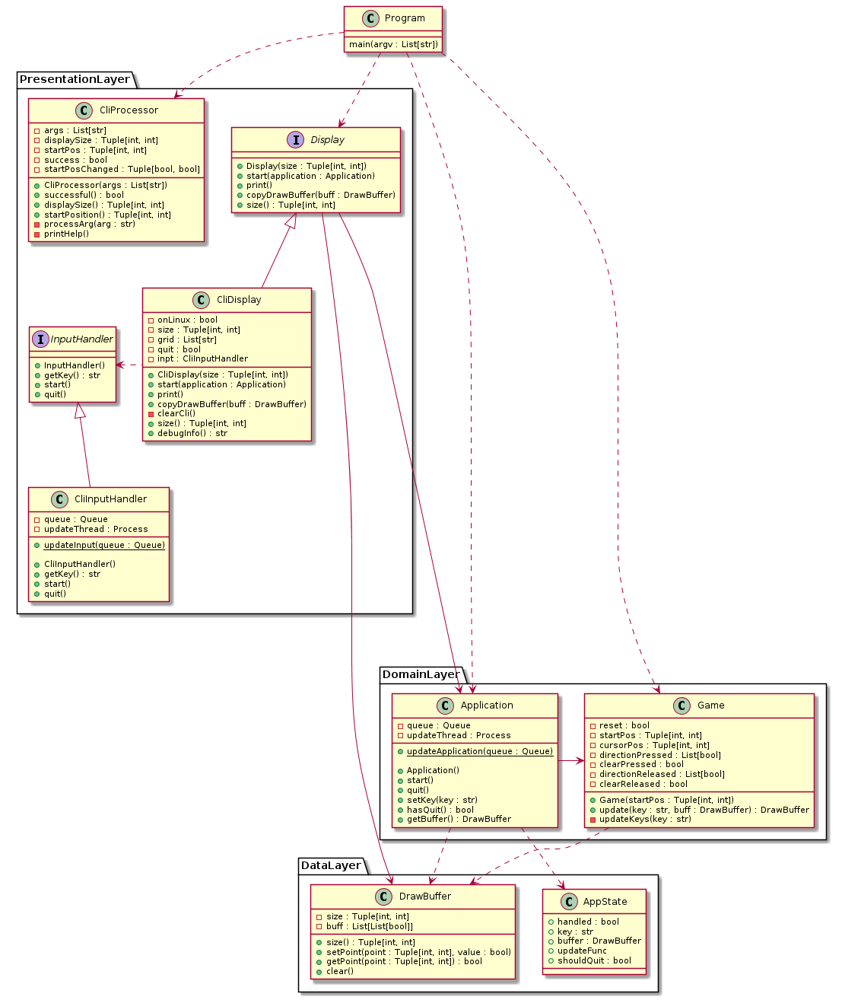
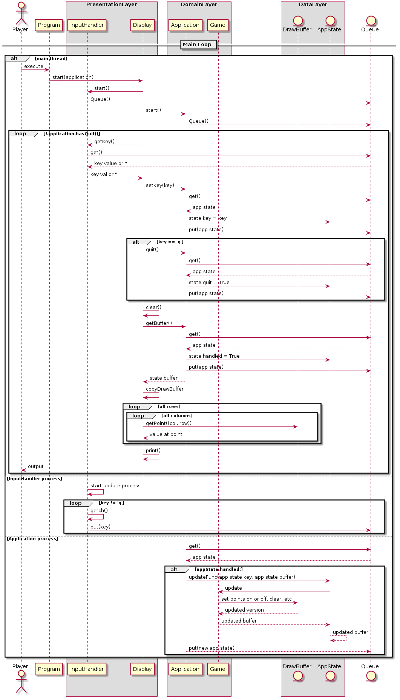

# Etch-A-Sketch (HW01)

## Description

A small etch-a-sketch game written in python

## Dependencies

Just the `getch` library

Using pip: `pip install getch`

## Running

To run:

1) In a terminal type:

   ```
   chmod +x ./etch-a-sketch.py
   ```

2) and then run with

   ```
   ./etch-a-sketch.py
   ```

View controls and cli options:

1) Run with the option `--help`:

   ```
   ./etch-a-sketch.py --help
   ```

   To see command line options and also the controls for the game

## Documentation

Here is a class diagram for the system:



And here is a rough sequence diagram for how it all connects and functions:



Note also that key press sequences, which aren't shown, are fairly simple and exist solely in the Game class. Basically when 'setKey' happens, key pressed booleans get set true, and when they get set false, it sets key-released booleans, which stay on until that input is handled. So when 'w' is pressed and released, the game class will move its cursor, draw the new cursor point, and then set the 'w' release to false

# hw01 grading

| Points      | Description |
| ----------- | ----------- |
|  8 | Etch-a-Sketch works
|  2 | Code documented
|  2 | Includes #!/usr/bin/env python3 and chmod +x
|  1 | install.sh included if needed - Needed pip3 install getch
|  2 | Used hw01 directory
|  2 | ReadMe.md included
|  0 | Name in gitLearn and gitLearnFork
| 17 | **Total**

It works, but wow, a bit of overkill.  

I see the ReadMe notes the need for the pip3 install, but I asked it to be in it's own file.
