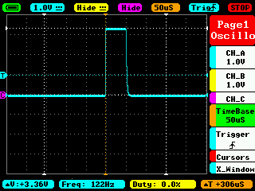
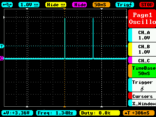

# HW02 Answers/Turn-in-ables

## Description

There are a few different things that appeared to be required as turn-ins for HW02

## Buttons and LEDs

From the hw02 document:

> 3. Write a simple program that reads the switches and lights a corresponding LED. Use interrupts. (callback in Python.)

This program is located in the `hw02/btn2led` folder

## Measuring a gpio pin on an Oscilloscope

> Get an oscilloscope so you can measure the output of your gpio pins. Run

```
bone$ cd exercises/gpio
bone$ ./togglegpio.sh 60 0.1
```

> and answer the following questions about gpio measurements.


Each of the following questions is from the hw02 document:

1. What's the min and max voltage?

   0 - 3.36V

2. What period is it?

    242ms

3. How close is it to 100ms?

   It's twice as slow


4. Why do they differ?

   Either because shell is really slow, or because it doesn't take period, it takes half-period

5. Run htop and see how much processor you are using.

   3.8% CPU

6. Try different values for the sleep time (2nd argument). What's the shortest period you can get? Make a table of the values you try and the corresponding period and processor usage. Try using markdown tables: https://www.markdownguide.org/extended-syntax/#tables

   | Sleep Time (s) | Period (ms) |
   |:----------:|:-------|
   | 0.1 | 242 |
   | 0.01 | 46.4 |
   | 0.001 | 43.6 |

   So, 43.6ms

7. How stable is the period?

   Decently stable. I'd say within 0.01ms

8. Try launching something like vi. How stable is the period?

   It starts to get off by almost 5ms

9. Try cleaning up togglegpio.sh and removing unneeded lines. Does it impact the period?

   Yes, it becomes much closer

10. togglegpio uses bash (first line in file). Try using sh. Is the period shorter?

   Yes. It gets a bit shorter

11. What's the shortest period you can get?

   Now I'm able to get around 15.8ms

### Python

From the doc:

> Write a python script to toggle a gpio pin. Answer the above questions for you Python script. Present the shell script and Python script results in a table for easy comparison.

This program is in the `hw02/gpio-measure/sysfs/c` python

### C

From the doc:

> Repeat the above using C. Modify togglegpio.c to use lseek() instead of opening and cloing the file. How much faster is it? Add your results to the table.

This program is in the `hw02/gpio-measure/sysfs/c` folder. It can be built with `make`

### Results Table

This is the output that I receive, specifically, this is the shell output


| Program | Min Max Voltage | CPU %  | Period at 0.1 | Period at 0.01 | Period at 0.001 | Period at 0.0001 | Shortest Period | Stable |
|:-:|:-:|:-:|:-:|:-:|:-:|:-:|:-:|:-:|
| Shell | 0 - 3.36V | 3.8% | 242ms | 46.4ms | 43.6ms | 43.6ms | 43.6ms | < 0.1 ms |
| Python - Sysfs | 0 - 3.36V | 1.3% | 102ms | 11.2ms | 2.02ms | 1.07ms | 0.6ms | 1ms |
| C - Sysfs | 0 - 3.36V | 0.7% | 100ms | 10.5ms | 1.38ms | 0.464ms | 0.362ms | 0.05ms |
| Python - Gpiod | 0 - 3.36V | 40.6% | 102ms | 11.1ms | 1.2ms | 0.912ms | 0.516ms | ~1 ms |
| C - Gpiod | 0 - 3.36V | 0.0% | 101ms | 10.2ms | 1.17ms | 0.264ms | 0.162ms | < 0.01 ms |
| Toggle 1 - 1 bit - Shell | 0 - 3.36V |  |  |  |  |  |  |  |
| Toggle 1 - 1 bit - C | 0 - 3.36V |  |  |  |  |  |  |  |
| Toggle 1 - 1 bit - Python | 0 - 3.36V |  |  |  |  |  |  |  |
| Toggle 1 - 2 bit - C | 0 - 3.36V |  |  |  |  |  |  |  |
| Toggle 1 - 2 bit - Python | 0 - 3.36V |  |  |  |  |  |  |  |

## gpiod

Redid the scripts with c and python with gpiod. The results are in the table above.

The new C program that is based on gpiod is in `hw02/gpio-measure/gpiod/c`. It can be built with `make`

The new Python program that is based on gpiod is in `hw02/gpio-measure/gpio/python`

Also tested using the toggle 1 examples in cloud9. Those results are also in the table except for shell, as shell was very strange.

Here's two pictures to illustrate what I mean.

The signal:



But it doesn't seem to repeat:



So I've just taken it out of the table as it's not meaningfully measurable.

## Security

Nothing is requested to be turned in for this

Here's my iptables though:

```
Chain INPUT (policy ACCEPT)
target     prot opt source               destination         
ACCEPT     tcp  --  192.168.7.0/24       anywhere             tcp dpt:5267
DROP       tcp  --  anywhere             anywhere             tcp dpt:5267
ACCEPT     tcp  --  137.112.4.0/24       anywhere             tcp dpt:5267

Chain FORWARD (policy ACCEPT)
target     prot opt source               destination         

Chain OUTPUT (policy ACCEPT)
target     prot opt source               destination         
# Warning: iptables-legacy tables present, use iptables-legacy to see them
```

## Etch-a-Sketch

The etch-a-sketch program, modified to use buttons, is located in `hw02/etch-a-sketch`
