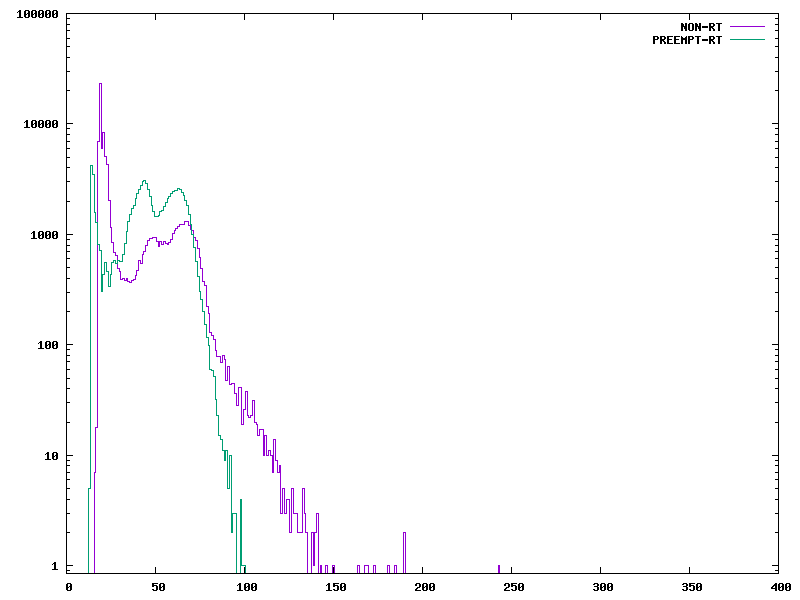
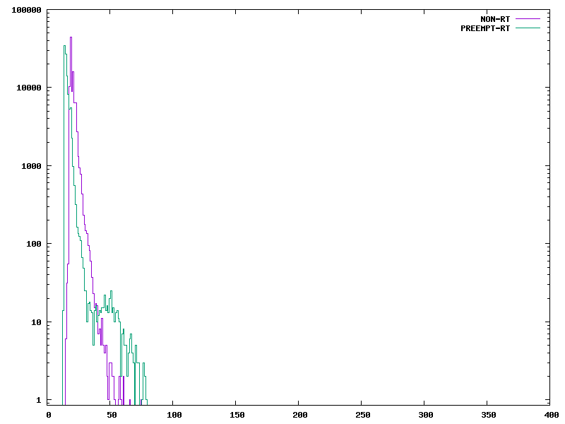

# hw06 grading

| Points      | Description |
| ----------- | ----------- |
|  2 | Project 
|  5 | Questions
|  4 | PREEMPT_RT
|  2 | Plots to 500 us  *Only went to 400 us*
|  5 | Plots - Heavy/Light load
|  2 | Extras
| 18 | **Total**

*My comments are in italics. --may*

# HW06 Answers

## Project Page

I added another idea for a project, using the bone as an Arcade Fighting stick.

Essentially you make the bone appear as a USB HID and send controller inputs based on the bone's GPIO which are wired to arcade buttons in a joystick.

One can also place the buttons in a nice wooden enclosure for structure

*I have some big buttons you can borrow.*

## Watch

> Watch’s Julia’s YouTube video[1] “What Every Driver Developer Should Know about RT”. Be ready to answer questions

1. Where does Julia Cartwright work?

National Instruments (Hey! That's where I'll be working!)

*I don't think she's there any more.*

2. What is PREEMPT_RT?

It's a patch for the Linux kernel to give it some RTOS-like capabilities

3. What is mixed criticality?

From the video:

> There are two different degrees of time sensitiveness

Real-time and non-real-time

4. How can drivers misbehave?

They share information between real-time stuff and regular linux stuff on the same driver stacks.

5. What is Δ in Figure 1?

Latency. Time from event to code essentially

6. What is Cyclictest?

It's a test used to characterize delta.

It takes a timestamp, sleeps, and then takes a new timestamp. The difference between the difference between the timestamps and the sleep time is delta.

7. What is plotted in Figure 2?

The difference between preempt_rt and regular kernel for the cyclictest

8. What is dispatch latency? Scheduling latency?

Amount of time between hardware firing to interrupt vs the time from the interrupt to the CPU to execute the task

9. What is mainline?

It's a model for showing long-running interrupts

10. What is keeping the External event in Figure 3 from starting?

A non-critical IRQ

11. Why can the External event in Figure 4 start sooner?

Non-critical IRQ code has been extracted from the specific IRQ calling part. Thus, the other IRQ can also trigger.

## PREEMPT_RT

> install and run a real time kernel

### Response Time

> Measure the response time for two cases, one with a heavy load (as suggested in [3]) and one with no load

> Have your histogram run out to at least 500 µs. Create two plots for each case. One for the RT kernel and one for the non-RT kernel.

1. Heavy Load

Rt:

```
real    1m40.309s
user    0m1.781s
sys     0m5.405s
```

Non-Rt:

``` 
real    1m40.203s
user    0m1.499s
sys     0m4.002s
```

Histogram:



2. No Load

Rt:

```
real    1m43.593s
user    0m0.742s
sys     0m2.050s
```

Non-Rt:

```
real    1m40.199s
user    0m0.760s
sys	    0m2.381s
```

Histogram:



### Commentary

> Comment on the plots. Does the RT kernel have a bounded latency? What are you using for a load?

The no load doesn't really show anything of interest, the plots are about the same. However in the heavy load, you can see that the RT kernel had a clear drop off in cycles after a certain amount of time.

This means that there is a bounded load.

Also I used the `make` and `make clean` repeated in the modules folder as per the Exercise.

