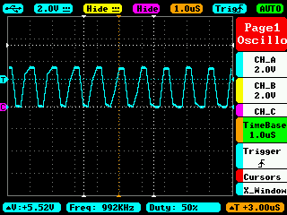

# HW08

## Blinking an LED

> What make command will start your PRU code running?

`make TARGET=hello.pru0 start`

> What will stop it

`make TARGET=hello.pru0 stop`

> Now modify the code to toggle P9_31 in the same way.

Couldn't get some GPIO to work (P9_31 included), so I'm using P8_12 bc I can consistently get it to work.

My version is in `hw08/pru-examples/02/hell0.pru0.c`

> Set the __delay_cycles() to 0

> How fast can you toggle the pin?

T = 2.96ms

> Is there jitter1?

YES. It's a triangle wave.

> Is it stable?

Mostly. I do see some places where the signal changes, but it's pretty good

## PWN Generator

> Now run the example in [6] but move the output pin to P9_31

Once again I'm using P8_12

> Do a ‘scope capture with the delays added to make the waveform symmetric and at 50 MHz.

So... my oscilloscope can only measure to around 350kHz, and as far as I know, I don't have access to one of the school's. However, I can still look at the symmetry of a wave with delay decently low. The lowest I get a reasonable signal at is 1MHz. I set the delay to 100 to get that.

> Comment on how stable the waveform is

It's not very stable, though that may just be due to my limited oscilloscope

> What’s the Std Dev?

1 or 2 us

> Is there jitter.

Yes
